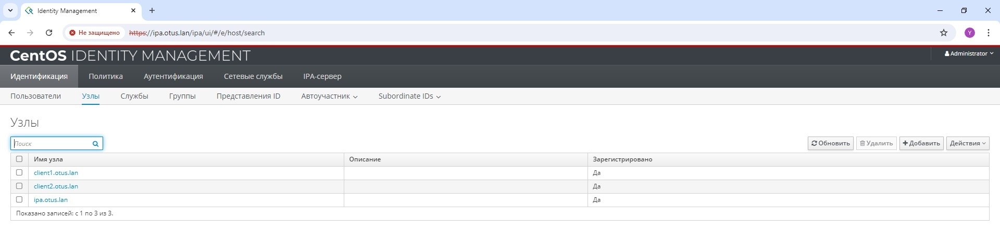
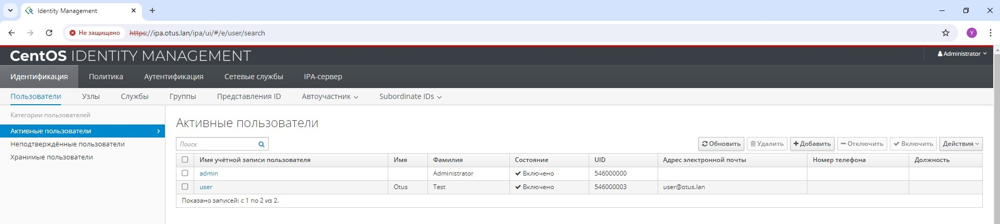

# Otus Homework 25. LDAP.
### Цель домашнего задания
Научиться настраивать LDAP-сервер и подключать к нему LDAP-клиентов
### Описание домашнего задания
1. Установить FreeIPA
2. Написать Ansible-playbook для конфигурации клиента
3. (*) Настроить аутентификацию по SSH-ключам
4. (**) Firewall должен быть включен на сервере и на клиенте
## Выполнение
С помощью _vagrant_ развернем тестовый стенд из двух виртуальных машин:
|Имя|IP-адрес|Описание|ОС|
|-|-|-|-|
|ipa.otus.lan|192.168.56.10|FreeIPA сервер|CentOS Stream 9|
|client1.otus.lan|192.168.56.11|Клиент 1|CentOS Stream 9|
|client2.otus.lan|192.168.56.12|Клиент 2|CentOS Stream 9|

На всех серверах настроим временную зону и отключим Selinux:
```bash
timedatectl set-timezone Europe/Moscow
setenforce 0
```
В рамках лабораторной работы нет необходимости настраивать DNS сервер. Вместо этого внесем изменения в файл _/etc/hosts_:
```bash
127.0.0.1   localhost localhost.localdomain localhost4 localhost4.localdomain4
::1         localhost localhost.localdomain localhost6 localhost6.localdomain6
127.0.1.1 ipa.otus.lan ipa
192.168.56.10 ipa.otus.lan ipa
```
Установим на сервер пакет ipa-server,
```bash
yum install -y ipa-server
```
а на клиенты ipa-cleint:
```bash
yum install -y ipa-client
```
Для настройки LDAP сервера необходимо запустить скрипт установки, в процессе работы которого нужно указать имя сервера, имя домена и пароль администратора:
```bash
ipa-server-install
```
По завершению установки мы сможем зайти на веб-интерфейс нашего сервера. Для этого необходимо внести соотвествие IP-адреса и имени сервера в локальный файл _hosts_.
  
  
  
### Настройка клиентов
Для конфигурации клиентов необходимо запустить скрипт:
```bash
ipa-client-install --mkhomedir --domain=OTUS.LAN --server=ipa.otus.lan --no-ntp -p admin -w Qwerty123
```
Где **OTUS.LAN** - имя нашего домена, **ipa.otus.lan** - имя LDAP сервера, **admin** - учетная запись LDAP администратора, **Qwerty123** - ее пароль.  
После этого они появятся в разделе Узлы в админке сервера:  
  
  
  
### Настройка аутентификации пользователя по SSH-ключам
Сгенерируем SSH-ключ пользователя командой `ssh-keygen`. Создадим нового пользователя в нашем домене, указав только что созданный публичный ключ:
```bash
echo "Qwerty123" | ipa user-add "user" --first="Otus" --last="Test" --shell="/bin/bash" --sshpubkey="ssh-rsa AAAAB3NzaC1yc2EAAAADAQABAAABgQCo4USOCaAsSsaDuQA2kdTLFtIvdxRVHqLGLAMbCqnEtJkrepdizeqgYKKChGVXGeCa+SlbCowHXkqagXk/oISL8gswOYl/bk4WZsXGHOXjPyxNOOt3TWepVF5kU73pZO9zv+ZwoDQCXTqolTA739ie3O1MhgQtzj8i081Q9ZqBEwNO5ZRlLmbNHuDcFV9opTrbqgSVqTC9f+rctaVIZCTFQfNnQ2VFBoB2i2pAwSSVfJUFEYgpAQjw9txTxXO+t5ikf+VbFmzk0Wb8VJF8XWOK/vAzYmj6APwL7t0yQ8fQg1CCMIL9TDkXLN8Fcd8Oqfzl2j1bL/bdyjFb+j0tLOU/P4lptCCLuzmtqLxg/XH4Thc7NidxfcaB6kpaXOXu8Bja/6ZftxjRIDzlm9D7z+kkfRM/58g4UEk3rfbOJW2thmXZlaf1b5bio/d50iYFkEIImmztPHeG6nM6ySge9BQa39JZcYrzpuLPHo5E/hdFwIqLaFpx/91h/swoWWzBnmM= root@ipa.otus.lan" --password
```
Созданный нами пользователь появится в админке:  
  
  

Как мы видим, ему успеншно добавился указанный ранее ключ:
  
  

После этого можем авторизовываться на сервервах домена по SSH-ключам.  
### Настройка файерволла
Для работы LDAP необходимо открыть следующие порты:
|Номер порта|Протокол|Название службы|
|-|-|-|
|53|tcp/udp|DNS|
|80, 443|tcp|HTTP/HTTPS|
|389, 636|tcp|LDAP/LDPAS|
|88, 464|tcp/udp|Kerberos|
|123|tcp/udp|NTP|

Помимо этого разрешим весь трафик для интерфейса _loopback_, _established related_ соединения, _ICMP_, а также _SSH_. 
Настроим эти правила с помощью **iptables**. После настройки установим политику по умолчанию _DROP_:
```bash
iptables -A INPUT -i lo -j ACCEPT
iptables -A INPUT -m state --state ESTABLISHED,RELATED -j ACCEPT
iptables -A INPUT -p tcp --dport 22 -j ACCEPT
iptables -A INPUT -p tcp --dport 53 -j ACCEPT
iptables -A INPUT -p udp --dport 53 -j ACCEPT
iptables -A INPUT -p tcp --dport 80 -j ACCEPT
iptables -A INPUT -p tcp --dport 443 -j ACCEPT
iptables -A INPUT -p tcp --dport 389 -j ACCEPT
iptables -A INPUT -p tcp --dport 636 -j ACCEPT
iptables -A INPUT -p tcp --dport 88 -j ACCEPT
iptables -A INPUT -p udp --dport 88 -j ACCEPT
iptables -A INPUT -p tcp --dport 464 -j ACCEPT
iptables -A INPUT -p udp --dport 464 -j ACCEPT
iptables -A INPUT -p tcp --dport 123 -j ACCEPT
iptables -A INPUT -p udp --dport 123 -j ACCEPT
iptables -P INPUT DROP
```
После настройки iptables примет слеюущий вид:
```bash
iptables -nvL


```
### Ansible
Для выполнения задания с помощью ansible необходимо запустить плэйбук:
```bash
ansible-playbook ipa.yml
```
